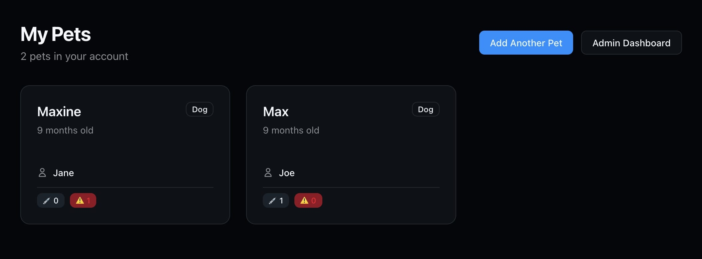

<h1 align="center">Novellia Pets</h1>

<p align="center">
  <a href="https://novellia-pets-production.up.railway.app/">Live Demo</a> · <a href="https://www.loom.com/share/7fb1c40018244083bfdabc8a3aa4599c?sid=0a0f846c-a0ad-435e-8b42-82648172af8c">Video Walkthrough</a>
</p>

<p align="center">A pet medical records management application built with Next.js 15, TypeScript, SQLite, and server components with cookie-based state management.</p>


## Features

- **Multi-Pet Support**: Users can create and manage multiple pets under a single cookie-based session.
- **Medical Record Management**: Add and view vaccination and allergy records for each pet.
- **Pet Dashboard**: View individual pet's profile and medical records at `/pets/[id]`.
- **User Dashboard**: View all your pets at homepage (`/`).
- **Admin Dashboard**: View all pet accounts system-wide with statistics at `/admin`.
- **QR Code for Emergency Access**: Downloadable QR code linking to pet's medical records for emergency responders.

## Why Next.js?

- **Compatibility**: Main Novellia App is built with Next.js. It's a good fit for this MVP.
- **Server Components & Server Actions**: Leverages Next.js App Router to keep UI rendering and mutation logic on the server — smaller client bundles, safer secrets, and simpler data fetching patterns.
- **Performance & SEO**: Built‑in server rendering, streaming, and automatic static optimization improve load times and crawlability for pet profiles and admin pages.
- **End‑to‑end Type Safety**: Native TypeScript support combined with Zod validation and Server Actions enables type-safe inputs/outputs from client forms to DB mutations.
- **Routing & Asset Handling**: File-system routing, route handlers, and optimized static asset delivery (images, QR exports) reduce boilerplate and deployment complexity.
- **Edge & Middleware Support**: Cookie-based session handling and middleware hooks allow flexible request-level logic without separate auth services.
- **Great DX & Hosting Options**: Fast refresh, detailed error overlays, and zero-config Vercel deployments speed iteration for an MVP.

These strengths make Next.js a pragmatic and efficient choice for building the Novellia Pets MVP.

## Quick Start

### Development

```bash
# Install dependencies
npm install

# Optional: seed database with sample data (15 pets)
npm run seed

# Start development server
npm run dev
```

Open http://localhost:3000 to view the application.

### Docker / Docker Compose

```bash
# Build and start (auto-seeds by default if enabled)
docker compose up --build

# Start in detached mode
docker compose up --build -d

# Disable auto-seeding (if the compose file reads SEED_DB)
SEED_DB=false docker compose up --build
```

### Railway Deployment

```bash
railway login && railway init && railway up
```

Add persistent volume (`/app/data`) and set `DATABASE_PATH=/app/data/novellia-pets.db` in Railway dashboard.

## Screenshots

### Pet Dashboard



### Pet Profile


### Admin Dashboard


## Data Model

### Database Schema

**pets table:**
```sql
CREATE TABLE pets (
  id INTEGER PRIMARY KEY AUTOINCREMENT,
  name TEXT NOT NULL,
  animal_type TEXT NOT NULL,
  owner_name TEXT NOT NULL,
  date_of_birth TEXT NOT NULL,  -- ISO 8601 (YYYY-MM-DD)
  created_at TEXT DEFAULT CURRENT_TIMESTAMP,
  updated_at TEXT DEFAULT CURRENT_TIMESTAMP
);
```

**medical_records table:**
```sql
CREATE TABLE medical_records (
  id INTEGER PRIMARY KEY AUTOINCREMENT,
  pet_id INTEGER NOT NULL,
  record_type TEXT NOT NULL,  -- 'vaccine' | 'allergy' | 'lab_result' | 'vital'
  data TEXT NOT NULL,         -- JSON: type-specific fields
  created_at TEXT DEFAULT CURRENT_TIMESTAMP,
  FOREIGN KEY (pet_id) REFERENCES pets(id) ON DELETE CASCADE
);

CREATE INDEX idx_medical_records_pet_id ON medical_records(pet_id);
CREATE INDEX idx_medical_records_type ON medical_records(record_type);
```

### Design Rationale

- Polymorphic records
  - Single `medical_records` table with `record_type` (discriminator) and `data` (JSON) for type-specific fields.
  - Pros: add types without migrations; simple mixed-timeline queries; fewer joins.

- Integrity & indexes
  - `FOREIGN KEY (pet_id) REFERENCES pets(id) ON DELETE CASCADE` for referential integrity.
  - Indexes: `idx_medical_records_pet_id` (pet lookups), `idx_medical_records_type` (type filters). Add partial/type-specific indexes if needed.

- Migrations & type safety
  - Schema managed via explicit SQL migrations (.sql).
  - Mirror DB shapes with TypeScript types (lib/db/schema.ts) and Zod schemas for runtime validation.

- Storage: SQLite
  - Chosen for zero-config dev/CI, file-based persistence, and JSON query support. Plan migration to Postgres for production.

## API Design

### Server Actions (Next.js 15 App Router)

All API logic uses Next.js Server Actions instead of REST endpoints for type-safe, server-side operations.

**Pet Operations (`app/actions/pets.ts`):**
- `createPet(data)` - Create new pet account
- `getPetById(id)` - Get single pet with all medical records
- `getPetsByIds(ids)` - Get multiple pets by IDs with record counts (user dashboard)
- `getPetsWithCounts()` - Get all pets with record counts (admin dashboard)
- `getStats()` - Get system statistics (total pets, records)

**Medical Record Operations (`app/actions/records.ts`):**
- `addVaccineRecord(petId, data)` - Add vaccine record
- `addAllergyRecord(petId, data)` - Add allergy record
- `getPetRecords(petId, type?)` - Get records for pet, optionally filtered by type

**User Session (`app/actions/user.ts`):**
- `getUserPetIds()` - Get array of user's pet IDs from HTTP-only cookie
- `addPetToUser(id)` - Add pet ID to user's pet collection in cookie
- `removePetFromUser(id)` - Remove pet from user's collection
- `clearUserPets()` - Clear all pets from user's session
- `getCurrentPetId()` - Get first pet ID (backward compatibility)

### Why Server Actions

- Type-safe end-to-end: TypeScript validation from client to database
- No need to define REST routes, request/response shapes
- Automatic error handling and serialization
- Progressive enhancement support
- Integrated with React Server Components

### REST API for External Clients

For demonstration, a REST API endpoint is included at `/api/pets` that **leverages the existing server actions**:
- `GET /api/pets` - List all pets with record counts (calls `getPetsWithCounts()`)
- `POST /api/pets` - Create new pet (calls `createPet()`)

This pattern avoids code duplication—API routes are thin wrappers around server actions. 
Extend to other resources for mobile apps, third-party integrations, or webhooks.

```bash
# Example usage

# List all pets
curl http://localhost:3000/api/pets

# Create a new pet
curl -X POST http://localhost:3000/api/pets \
  -H "Content-Type: application/json" \
  -d '{"name":"Buddy","animalType":"dog","ownerName":"John","dateOfBirth":"2020-01-01"}'
```

### Request/Response Shapes

All actions return standardized response:
```typescript
{ success: true, data: T } | { success: false, error: string }
```

Validation handled by Zod schemas in `lib/validations/`.

## Pages and UX

### Page Structure

All pages are **React Server Components** for better performance and SEO.

1. **Homepage (`/`)** - User's Pet Dashboard / Landing Page
   - **Purpose:** Personal dashboard showing user's pets, or landing page for new users
   - **No pets (userPetIds = []):**
     - App title, tagline, and feature highlights
     - Tech stack showcase with hoverable badges explaining rationale
     - Demo information (15 pre-seeded pets available)
     - "Create Your First Pet" button + "Admin Dashboard" link
     - Creating first pet redirects to `/pets/[id]`
   - **Has pets (userPetIds = [1, 3, 5]):**
     - "My Pets" header with count
     - Responsive grid of user's pet cards (1 col mobile, 2 tablet, 3 desktop)
     - Each card shows pet name, type, age, owner, vaccine/allergy counts
     - Click card → Navigate to `/pets/[id]`
     - "Add Another Pet" button + "Admin Dashboard" button
     - Adding additional pet refreshes homepage with updated grid

2. **Pet Dashboard (`/pets/[id]`)** - Individual Pet View
   - **Purpose:** View and manage specific pet's medical records
   - Pet profile card (name, type, owner, age, DOB)
   - QR code card (desktop only, hidden on mobile)
   - Medical records tabs (All/Vaccines/Allergies)
   - Add Vaccine/Allergy buttons (responsive drawer on mobile)
   - ScrollArea with flexbox layout for dynamic height
   - Breadcrumb: "Homepage > {Pet Name}" or "Homepage > Admin > {Pet Name}"
   - Used for both user's own pets and viewing pets from admin dashboard

3. **Admin Dashboard (`/admin`)** - All Pets System-Wide
   - **Purpose:** System overview with all pet accounts
   - Breadcrumb: "Homepage > Admin"
   - Compact statistics card (pets, vaccines, allergies with emojis)
   - Responsive grid of ALL pet cards (1 col mobile, 2 tablet, 3 desktop)
   - ScrollArea fills remaining viewport
   - Each pet card links to `/pets/[id]?from=admin`
   - "Add New Pet" button + "Back to My Pets" navigation

### Account Model

**Multi-Pet Support (Cookie-Based):**
- User session tracked via HTTP-only cookie storing array of pet IDs
- No traditional authentication/login system for MVP
- `userPetIds` cookie stores JSON array: `[1, 3, 5]`
- Users can create and manage multiple pets under one session
- Cookie persists across sessions on the same browser/device when a persistent HTTP-only cookie is used; it does not sync across different devices or browsers.
- Homepage displays a responsive grid of the user's pets as a personal dashboard (1 column mobile, 2 tablet, 3 desktop). Each pet card links to /pets/[id] and shows summary info (name, type, age, owner, vaccine/allergy counts).

## Extra Features

### QR Code for Emergency Access

Each pet profile includes a downloadable QR code that links directly to their medical records.

**Use case:** Print and attach to pet collar for emergency access by vets, shelters, or finders.

**Implementation:**
- Generates QR code pointing to `/pets/[id]`
- Display on pet profile pages (homepage & detail view)
- Download button exports PNG file: `{PetName}-medical-records-qr.png`
- Uses `qrcode` library for client-side generation

**Why this feature:**
- **Safety:** Emergency responders can instantly access allergy/vaccination info
- **Practical:** Addresses real-world need (lost pets, vet visits, boarding)

### UX Choices

**Shadcn UI:**
- Component library leverages Tailwind CSS
- Easy theming with CSS variables
- Consistent design across pages

**Server-First Architecture:**
- All pages are React Server Components
- Server Actions for mutations (type-safe, no REST endpoints)
- Cookie-based state management

**Responsive Design:**
- Media query hook (`use-media-query.ts`) determines layout
- Forms open as Dialogs on desktop (≥768px), Drawers on mobile

**Medical Records:**
- Tabs for All Records, Vaccines, Allergies
- Card-based list with badges for severity/type

**Feedback & Validation:**
- Toast notifications (Sonner) for all mutations
- Zod validation with inline error messages
- Loading states with React transitions

## Tech Stack

- **Next.js 15.5.6** - React framework with App Router
- **React 19** - UI library with Server Components
- **TypeScript** - Type safety (strict mode)
- **Tailwind CSS 4** - Styling
- **SQLite** (better-sqlite3) - Database
- **Zod** - Schema validation
- **shadcn/ui** - Component library (20 components being used)

## Project Structure

```
app/
├── page.tsx                    # User's pet dashboard / landing page
├── pets/
│   └── [id]/
│       ├── page.tsx            # Pet dashboard (individual pet view)
│       └── not-found.tsx       # Pet not found page
├── admin/
│   └── page.tsx                # Admin dashboard (all pets system-wide)
├── api/
│   └── pets/
│       └── route.ts            # REST API endpoint (demo)
├── layout.tsx                  # Root layout with theme provider
├── not-found.tsx               # Global 404 page
├── actions/
│   ├── user.ts                 # Cookie-based multi-pet management (userPetIds array)
│   ├── pets.ts                 # Pet CRUD operations
│   └── records.ts              # Medical record operations

components/
├── ui/                         # shadcn/ui components (17 total)
│   ├── breadcrumb.tsx
│   ├── dialog.tsx
│   ├── drawer.tsx
│   ├── scroll-area.tsx
│   └── ... (13 more)
├── pets/
│   ├── PetCard.tsx             # Pet card for admin grid
│   ├── PetQRCode.tsx           # QR code component for emergency access
│   ├── AddPetDialog.tsx        # Responsive pet creation dialog/drawer
│   └── PetForm.tsx             # Pet form with validation
├── records/
│   ├── RecordsList.tsx         # Medical records list
│   ├── AddRecordButtons.tsx    # Add vaccine/allergy buttons
│   ├── VaccineForm.tsx         # Vaccine form
│   └── AllergyForm.tsx         # Allergy form
├── AdminStats.tsx              # Compact statistics display
└── theme-provider.tsx          # Dark mode provider

lib/
├── db/
│   ├── schema.ts               # TypeScript types
│   ├── client.ts               # SQLite connection
│   └── migrations/
│       └── 001_initial.sql     # Schema + seed data
├── validations/
│   ├── pet.ts                  # Pet Zod schemas
│   └── record.ts               # Record Zod schemas
└── utils/
    ├── format.ts               # Date/age formatting
    └── constants.ts            # Animal types, severities

hooks/
└── use-media-query.ts          # Responsive layout hook

scripts/
└── seed-db.ts                  # Database seeding script
```

## Production Improvements

### Authentication & Authorization
- Implement proper user authentication (NextAuth.js, or Supabase Auth)
- Role-based access control (admin vs regular users)

### Database & Persistence
- Migrate from SQLite to PostgreSQL for production
- Database migrations management (Prisma, Drizzle)

### Monitoring & Observability
- Application performance monitoring (DataDog, CloudWatch, etc.)
- User analytics (Google Analytics)

### Testing
- Unit tests for server actions and utilities
- End-to-end tests for critical user flows
- API integration tests

### DevOps & Deployment
- CI/CD pipeline (GitHub Actions, Vercel)
- Staging and production environments
- Environment variable management

### Possible Features
- File upload for medical documents/images
- Export medical records to PDF
- Search and filtering in admin dashboard
- Audit logs for all changes
- Soft deletes with restore capability
- Multi-language support

## License

MIT
